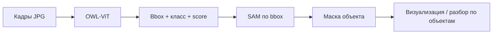

# SAM + OWL-ViT: детекция и сегментация объектов на дорожных кадрах

Два Jupyter-ноутбука реализуют один и тот же пайплайн анализа изображений с видеорегистратора (или других источников кадров дороги). Разница между версиями — только в способе задания путей к данным и весам моделей.

| Файл | Назначение |
|------|------------|
| `notebooks/Segment Anything (SAM) + OWLVIT-v3.ipynb` | Рекомендуемая версия: пути берутся из `local_config.py` (с запасным вариантом жёстко прописанных путей Windows). |
| `notebooks/Segment Anything (SAM) + OWLVIT-v4.ipynb` | Та же логика; все пути заданы прямо в ячейках ноутбука (Windows). |

## Что делает программа

Пайплайн в два этапа обрабатывает кадры дороги и ищет на них объекты по **текстовым описаниям** (open-vocabulary detection), затем строит **точные маски** найденных объектов.



### Этап 1 — детекция (OWL-ViT)

- Модель: `google/owlvit-base-patch32` (Hugging Face Transformers).
- На вход подаётся изображение и длинный список английских текстовых меток (`texts`) — от транспорта и знаков до разметки, дефектов покрытия и элементов инфраструктуры.
- Модель возвращает ограничивающие рамки (bounding box), метку класса и оценку уверенности.
- Отсечение по порогу: **score > 0.15** (настраивается в коде).

Группы искомых объектов:

| Категория | Примеры меток |
|-----------|----------------|
| Транспорт и участники | `car`, `truck`, `person` |
| Окружение | `tree`, `road sign`, столбы (`lamp post`, `utility pole`, …) |
| Дорожная разметка | `lane marking`, `crosswalk`, `stop line`, стрелки, полосы и т.д. |
| Дефекты покрытия | трещины, выбоины, колея, износ, заплатки |
| Инфраструктура | люки, решётки, бордюры, откосы |
| Нарушения разметки / ремонт | выцветшая разметка, временные заплатки, следы дорожных работ |

### Этап 2 — сегментация (SAM)

- Модель: **Segment Anything** (`vit_b` по умолчанию, веса `sam_vit_b_01ec64.pth`).
- Для каждого bbox от OWL-ViT SAM строит маску (`multimask_output=True`, выбирается вариант с максимальным score SAM).
- Результаты сохраняются в памяти в списках `all_results` и `all_results_with_masks`.

### Обработка кадров (первая ячейка)

1. Берутся первые **3** файла из папки с изображениями (по шаблону имён `frame_0.0.jpg`, `frame_1.0.jpg`, …).
2. Для каждого кадра: детекция → сегментация → вывод в консоль.
3. Рисуются два графика:
   - **слева** — исходный кадр с bbox и подписями классов;
   - **справа** — цветные маски SAM с контурами и подписями.

### Детальный разбор одного кадра (вторая ячейка)

- Выбирается конкретный кадр (в коде: `tmp = 'frame_1я.0.jpg'` — имя нужно подставить под свои файлы).
- Для каждого найденного на этом кадре объекта строится сетка из трёх колонок:
  1. обрезка по bbox;
  2. маска SAM (оттенки серого);
  3. наложение маски на обрезку (красная полупрозрачная заливка).

Структура одной записи в `all_results_with_masks`:

| Индекс | Содержимое |
|--------|------------|
| 0 | имя файла кадра |
| 1 | текстовая метка класса |
| 2 | score OWL-ViT |
| 3 | координаты bbox `[x1, y1, x2, y2]` |
| 4 | маска SAM (`numpy`, или `None` при ошибке) |
| 5 | score SAM |

## Отличия v3 и v4

Логика детекции и сегментации **идентична**. Отличается только конфигурация путей:

| | v3 | v4 |
|---|----|----|
| Папка с кадрами | `local_config.images_path` или fallback `D:\...\testing_video_results2\` | жёстко в ячейке |
| Веса SAM | `local_config.SAM_CHECKPOINT` или fallback | жёстко в ячейке |
| Вторая ячейка | `images_path + tmp` | полный путь в строке |
| Пустая ячейка | есть (3-я) | нет |

Для работы в Linux/Cursor удобнее **v3** после настройки `local_config.py`.

## Зависимости и запуск

```bash
cd "Нейронка_ЦИИ"
./setup.sh
```

Скрипт создаёт виртуальное окружение в корне vault, ставит зависимости из `requirements.txt`, регистрирует Jupyter-ядро `SAM + OWL-ViT (РосАвтоДор)` и копирует `local_config.example.py` → `local_config.py`.

Основные пакеты: `torch`, `transformers`, `segment-anything`, `opencv-python`, `matplotlib`, `scikit-image`, `Pillow`.

Веса SAM (пример для `vit_b`):

```bash
wget -O "Нейронка_ЦИИ/weights/sam_vit_b_01ec64.pth" \
  https://dl.fbaipublicfiles.com/segment_anything/sam_vit_b_01ec64.pth
```

Кадры положите в `Нейронка_ЦИИ/data/images/` и укажите пути в `local_config.py`. При наличии GPU используется CUDA, иначе CPU.

## Рабочий пайплайн масок (видео/камера)

Для production-запуска добавлены скрипты:

- `mask_pipeline.py` — core-логика детекции OWL-ViT + сегментации SAM и сборки бинарной маски.
- `camera_tools/run_mask_pipeline.py` — CLI-обвязка для обработки видеофайла или камеры.

### Формат выхода

- Выходная маска — `uint8`, где:
  - `0` = фон
  - `255` = целевой объект
- В текущей версии все найденные объекты объединяются в одну бинарную маску.
- Архитектура подготовлена для будущего расширения до RGB-маски с разными цветами по классам.

### Режим 1: видеофайл -> сохраненный ролик маски

Через `Makefile`:

```bash
make mask-video INPUT_VIDEO=recordings/road.mp4 MASK_OUTPUT=outputs/road_mask.mp4 FPS=10 THRESHOLD=0.15 CALIB_FILE=camera_tools/undistortion/config/camera_calib.yml
```

Прямой запуск:

```bash
python camera_tools/run_mask_pipeline.py \
  --mode video \
  --input recordings/road.mp4 \
  --output outputs/road_mask.mp4 \
  --fps 10 \
  --threshold 0.15 \
  --calib camera_tools/undistortion/config/camera_calib.yml
```

### Режим 2: камера -> поток маски (RTSP/UDP)

Через `Makefile` (UDP по умолчанию):

```bash
make mask-camera CAMERA=0 STREAM_URL="udp://127.0.0.1:5000?pkt_size=1316" STREAM_FORMAT=udp CALIB_FILE=camera_tools/undistortion/config/camera_calib.yml
```

RTSP:

```bash
make mask-camera CAMERA=0 STREAM_URL="rtsp://127.0.0.1:8554/mask" STREAM_FORMAT=rtsp CALIB_FILE=camera_tools/undistortion/config/camera_calib.yml
```

Прямой запуск:

```bash
python camera_tools/run_mask_pipeline.py \
  --mode camera \
  --camera 0 \
  --fps 10 \
  --width 1280 \
  --height 720 \
  --stream-url "udp://127.0.0.1:5000?pkt_size=1316" \
  --stream-format udp \
  --calib camera_tools/undistortion/config/camera_calib.yml
```

### Проверка входящего потока

UDP:

```bash
ffplay "udp://127.0.0.1:5000?fifo_size=1000000&overrun_nonfatal=1"
```

RTSP:

```bash
ffplay "rtsp://127.0.0.1:8554/mask"
```

### Дополнительные параметры

- `--texts "car,pothole,road sign"` — заменить список классов на свой (через запятую).
- `--preview` — показать окно маски во время обработки.
- `THRESHOLD`/`--threshold` — порог детекции OWL-ViT.

### Ограничения производительности

- OWL-ViT + SAM тяжелые для realtime на CPU, поэтому лучше начинать с низкого FPS (`5-10`) и/или меньшего разрешения.
- Поток не падает при пустых детекциях: на выходе будет черная маска для такого кадра.

## Второй пайплайн: YOLO-детекторы дефектов покрытия

В отличие от SAM + OWL-ViT (open-vocabulary, детекция по тексту), это набор из
**пяти узкоспециализированных YOLO-моделей** — ровно те же веса, что использует
боевой Airflow DAG (`vav_dag_1.py`). Каждая модель обучена на одном типе дефекта:

| Модель | Файл весов |
|--------|------------|
| Продольная трещина | `best_111_longtitude.pt` |
| Поперечная трещина | `best_104_transversive.pt` |
| "Крокодиловая" трещина | `best_105_alligator_crack.pt` |
| Яма | `best_116_pothole.pt` |
| Дорожная разметка | `best_112_road_marks.pt` |

Веса лежат в `weights_yolo/` (в git не попадают, см. `.gitignore`).

- `yolo_pipeline.py` — core-логика: класс `RoadDefectYoloPipeline` загружает все
  пять моделей и прогоняет через них кадр, объединяя детекции в один список.
- `camera_tools/run_yolo_image.py` — CLI для одного изображения: рисует боксы
  с именем класса и confidence, сохраняет PNG. По аналогии с `run_mask_image.py`,
  но без сегментации (YOLO отдаёт только bbox, не маску) и без обязательной
  калибровки — `--calib` опционален, т.к. эти модели обучены на сырых кадрах
  видеорегистратора, а не на кадрах со стенда SAM/OWL-ViT.

Запуск:

```bash
make yolo-image INPUT_IMAGE=outputs/test_input_frame2.png YOLO_THRESHOLD=0.25
make yolo-image-from-video INPUT_VIDEO=recordings/webcam_20260515_190833.mp4 FRAME_IDX=120
```

Прямой запуск:

```bash
python camera_tools/run_yolo_image.py \
  --input-image outputs/test_input_frame2.png \
  --output-dir outputs/single_image_yolo \
  --output-name yolo_detections.png \
  --threshold 0.25
```

**Важно:** это проверяет, что модели корректно загружаются и работают
(«водопровод» пайплайна), а не качество детекции — для содержательного теста
нужны реальные кадры дорожного покрытия с видеорегистратора, а не тестовые
фото со стенда. Расчёт физических размеров дефекта (длина/ширина/диаметр из
`DistanceCalculator` в `vav_dag_1.py`) сюда сознательно не перенесён: он
откалиброван под конкретную оптику и положение камеры конкретного
видеорегистратора и даст неверные цифры на кадрах с другой камеры.

## Настройка под свои данные

Перед запуском измените:

1. **`images_path`** — каталог с JPG/PNG кадрами.
2. **`SAM_CHECKPOINT`** и при необходимости **`MODEL_TYPE`** (`vit_b` / `vit_l` / `vit_h`).
3. Шаблон имён файлов в цикле (`frame_{i}.0.jpg`) и переменную `tmp` во второй ячейке.
4. Список **`texts`** — добавьте или уберите метки под задачу.
5. **`threshold`** — порог уверенности детекции (по умолчанию `0.15`).
6. Число обрабатываемых кадров: `os.listdir(images_path)[:3]`.

## Ограничения

- Это **исследовательский/демонстрационный** скрипт: результаты хранятся в переменных ноутбука, на диск не экспортируются.
- OWL-ViT чувствителен к формулировкам меток и качеству кадра; ложные срабатывания возможны при низком пороге.
- Первый прогон скачивает веса OWL-ViT с Hugging Face (~600 МБ).
- В v4 пути заточены под Windows; на Linux без правки путей ноутбук не откроет файлы.

## Документация

- [docs/ISSUES_FOR_REVIEW.md](docs/ISSUES_FOR_REVIEW.md) — **обзор проблем для
  команды**, сжато: четыре темы, по каждой что мешает, на что влияет и что
  предлагается делать
- [docs/ISSUES_FOR_REVIEW_FULL.md](docs/ISSUES_FOR_REVIEW_FULL.md) — то же
  подробно: двенадцать проблем по отдельности, со статусами
- [docs/OPEN_ISSUES.md](docs/OPEN_ISSUES.md) — устройство всего пайплайна и
  полный внутренний список открытых проблем: архитектура, дообучение,
  постобработка, вопросы к смежным этапам
- [docs/ARCHITECTURE.md](docs/ARCHITECTURE.md) — как устроен модуль детекции
  и ROS-нода, с диаграммами
- [docs/INTEGRATION_ROS.md](docs/INTEGRATION_ROS.md) — встраивание в свой код
- [docs/USAGE_ROS_NODE.md](docs/USAGE_ROS_NODE.md) — запуск и отладка ноды
- [docs/SPEC_process_frame.md](docs/SPEC_process_frame.md) — режимы обработки кадра

## Связанные файлы

- `requirements.txt` — зависимости Python
- `setup.sh` — установка окружения и ядра Jupyter
- `local_config.example.py` — шаблон путей для v3
- `mask_pipeline.py` — core-пайплайн масок
- `camera_tools/run_mask_pipeline.py` — запуск видео/камера -> маска (файл/поток)
- `Makefile` — быстрые команды `record-webcam`, `mask-video`, `mask-camera`, `mask-image`, `calib-capture`
