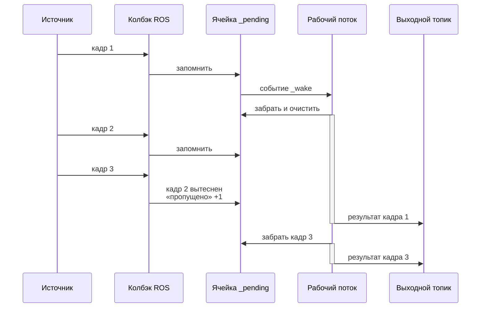
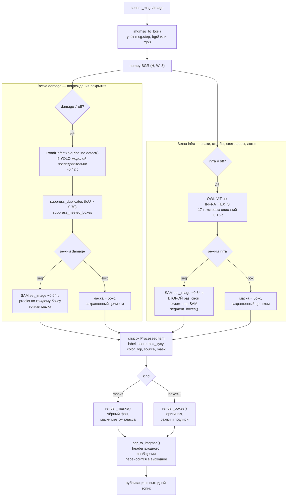
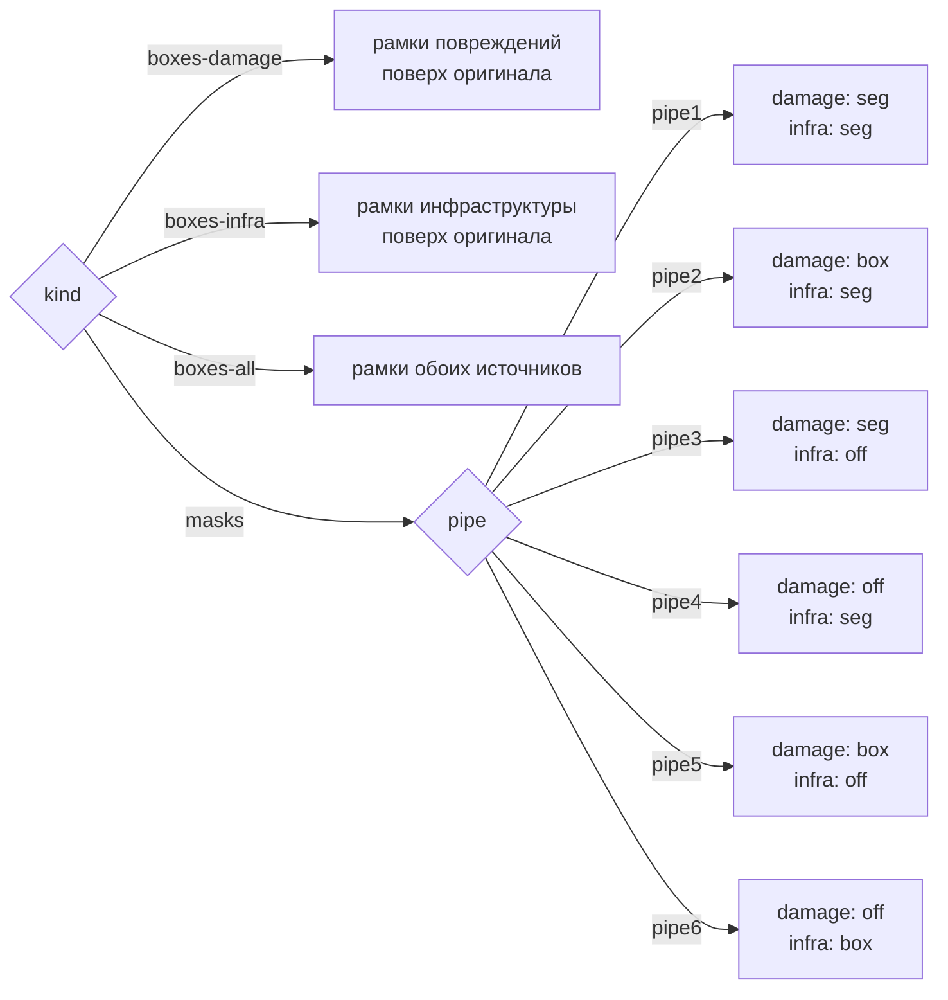
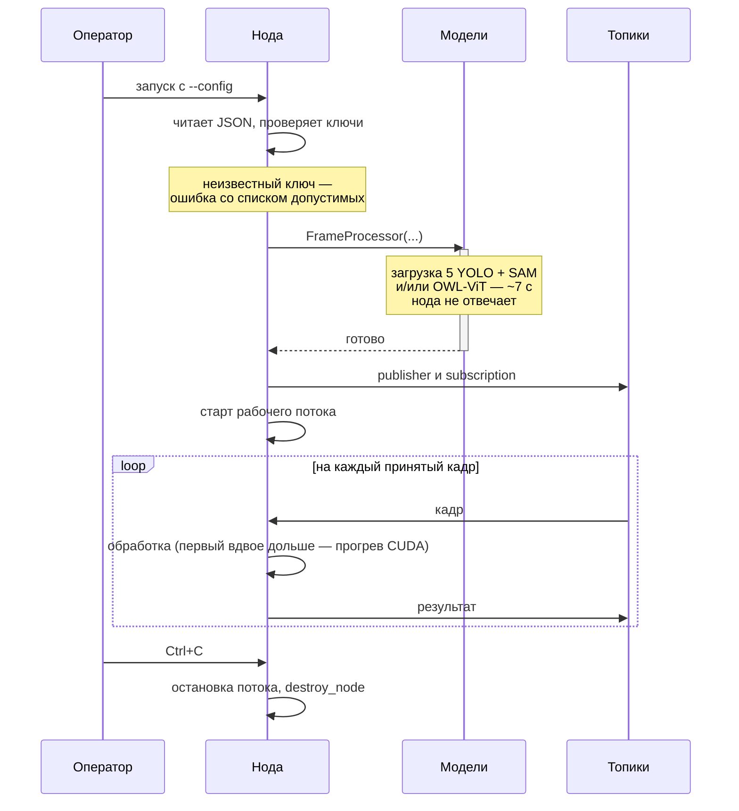
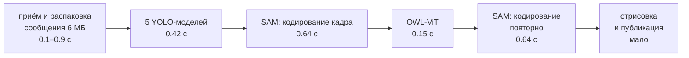

# Архитектура: ROS-нода и обработка кадров нейросетями

Как устроен путь кадра от входного топика до выходного и что происходит внутри.
Про запуск и настройку — [USAGE_ROS_NODE.md](USAGE_ROS_NODE.md), про встраивание
в свой код — [INTEGRATION_ROS.md](INTEGRATION_ROS.md).

---

## 1. Граф ROS

Топики и QoS задаются в JSON-конфиге. Вход по умолчанию `best_effort` — так
публикуют драйверы камер. Выход `reliable`, чтобы результат не терялся.

---

## 2. Два потока внутри ноды

Обработка кадра занимает 0.4–2.2 с, а кадры приходят каждые 166 мс. Если бы
колбэк обрабатывал кадр сам, он заблокировал бы исполнителя ROS на секунды.
Поэтому колбэк только запоминает последний кадр, а работа идёт в отдельном потоке.

Ячейка рассчитана ровно на один кадр. Очередь не растёт, задержка не
накапливается, в обработку всегда уходит самый свежий кадр.

---

## 3. Конвейер обработки кадра

Ветки независимы: обе, одна или другая — в зависимости от режима.

---

## 4. Выбор режима

Выбор двумерный. Флаги `pipe1…pipe6` — именованные комбинации двух параметров.

|  | infra: seg | infra: box | infra: off |
|---|---|---|---|
| **damage: seg** | `pipe1` | — | `pipe3` |
| **damage: box** | `pipe2` | — | `pipe5` |
| **damage: off** | `pipe4` | `pipe6` | запрещено |

Модели загружаются **лениво под выбранный режим**: при `damage: off` пять
YOLO-моделей не поднимаются вообще, при `infra: off` не грузится OWL-ViT.
Экономятся и память, и время старта.

---

## 5. Жизненный цикл ноды

---

## 6. Где уходит время

| Этап | Время | Когда выполняется |
|---|---|---|
| 5 моделей YOLO | 0.42 с | `damage` ≠ off |
| SAM: кодирование кадра | 0.64 с | `damage` = seg |
| SAM: маска на каждый бокс | мало | за каждый найденный объект |
| OWL-ViT | 0.15 с | `infra` ≠ off |
| SAM: кодирование кадра повторно | 0.64 с | `infra` = seg |
| приём и распаковка сообщения | 0.1–0.9 с | всегда, зависит от нагрузки |

**Известная потеря.** У ветки damage и ветки infra свои экземпляры SAM, и каждый
независимо прогоняет один и тот же кадр через энкодер. В режимах `pipe1` и `pipe2`
это лишние 0.64 с. Общий экземпляр убрал бы их. Пока не сделано.

---

## 7. Итоговые числа

Замеры на Jetson AGX Orin, кадры 1920×1080:

| Режим | Время на кадр | FPS |
|---|---|---|
| `pipe5` — повреждения боксами | 0.42 с | 2.4 |
| `pipe3` — повреждения масками SAM | 1.09 с | 0.9 |
| `pipe1` — полный цикл | 1.27 с | 0.8 |

В реальном прогоне через ROS выходило 1.3–2.2 с на кадр: добавляются приём и
распаковка сообщений.

Съёмка идёт на 6 FPS — это 166 мс на кадр. Даже самый быстрый режим в 2.5 раза
медленнее, полный цикл в 8 раз. **Обработка каждого кадра в темпе съёмки
невозможна** — отсюда вытеснение кадров из раздела 2.
