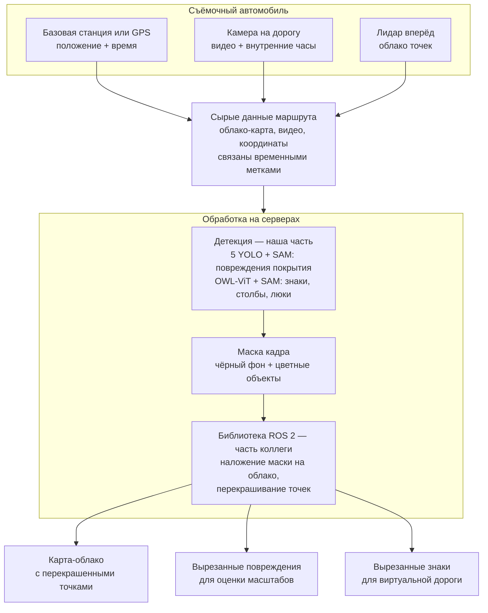

# Открытые вопросы и проблемы проекта

Живой список проблем, требующих решения: архитектура, дообучение моделей,
постобработка результатов детекции, стыковка со следующими этапами.

Документ дополняется по мере появления вопросов. Если проблема решена — статус
меняется, запись остаётся вместе с принятым решением.

Смежные документы: [ARCHITECTURE.md](ARCHITECTURE.md) — устройство модуля
детекции, [INTEGRATION_ROS.md](INTEGRATION_ROS.md) — встраивание,
[USAGE_ROS_NODE.md](USAGE_ROS_NODE.md) — эксплуатация ноды.

---

## 1. Как устроен пайплайн

Машина движется по дороге, установленное оборудование снимает весь путь.

**Что получаем на вход:**

- положение автомобиля — базовая станция или GPS;
- видео с камеры с видом на дорогу прямо перед автомобилем;
- облако точек с лидара, направленного вперёд на дорогу.

Альтернативная схема установки: камера и лидар направлены просто вперёд, чтобы
в кадр попадали дорожные знаки.

**В каком виде данные:** облако точек представляет собой карту всего маршрута;
видео с привязкой ко внутренним часам; координаты от базовой станции с привязкой
ко времени.

**Что нужно получить на выходе:**

- карту из облака точек, на которой перекрашены точки обнаруженных повреждений;
- отдельно вырезанные повреждения — для оценки масштабов повреждений покрытия;
- отдельно вырезанные дорожные знаки — для размещения на виртуальной дороге.

**Как это достигается сейчас.** Обработка идёт на серверах. Точки облака
перекрашивает библиотека на ROS 2 — зона ответственности коллеги. На вход ей
подаётся кадр с камеры, который накладывается на облако. Кадр представляет собой
чёрное изображение с цветными масками, и точки окрашиваются в цвет
продетектированного объекта. Такой способ передачи выбран осознанно как временное
решение, ради скорости разработки.




### Текущая палитра

Значения BGR, как в коде (`yolo_pipeline.MODEL_KEY_COLORS_BGR`,
`mask_pipeline.INFRA_COLORS_BGR`). Чёрный `(0, 0, 0)` — фон, объектов нет.


| Класс                | BGR               | Цвет       |
| -------------------- | ----------------- | ---------- |
| Яма                  | `(0, 0, 255)`     | красный    |
| Крокодиловая трещина | `(255, 0, 255)`   | пурпурный  |
| Продольная трещина   | `(0, 255, 255)`   | жёлтый     |
| Поперечная трещина   | `(255, 255, 0)`   | голубой    |
| Разметка             | `(0, 255, 0)`     | зелёный    |
| Дорожный знак        | `(0, 165, 255)`   | оранжевый  |
| Столб, опора, фонарь | `(255, 0, 0)`     | синий      |
| Светофор             | `(226, 43, 138)`  | фиолетовый |
| Люк, решётка         | `(255, 255, 255)` | белый      |


---


## 2. Как читать документ

**Статусы:**

- `предполагаемая` — проблема ожидается, но на практике пока не подтверждена;
- `подтверждённая` — воспроизведена, есть наблюдения;
- `принятое ограничение` — знаем, решили жить с этим;
- `решена` — с описанием принятого решения.

Идентификаторы: `A` — архитектура и интерфейс, `N` — модели и дообучение,
`P` — постобработка, `C` — согласование с коллегой.

---


## 3. Проблема №1: нестабильность детекции между кадрами

**Статус:** предполагаемая, не подтверждённая. Проверить сейчас нечем, но
вероятность высокая — поэтому фиксируем заранее вместе с вариантами решения.

**Влияет на:** итоговое раскрашивание облака точек. Если между соседними кадрами
одно и то же повреждение детектируется по-разному, точки одного участка получают
разные цвета, и результат становится нестабильным.

### Вероятные причины

Их, судя по всему, две, и вторая относится к нашему коду.

1. **Шум детектора.** Уверенность модели на соседних кадрах плавает: сменилось
  освещение, чуть другой ракурс, блик на мокром асфальте.
2. **Winner-take-all в подавлении пересечений.** В `suppress_duplicates`
  ([yolo_pipeline.py](../yolo_pipeline.py)) из перекрывающихся рамок остаётся
   одна самая уверенная, **без учёта класса**. Яма и крокодиловая трещина
   визуально похожи, и обе модели часто срабатывают на одном объекте:

   ```
   кадр 1:  яма 0.51  |  трещина 0.49   →  победила яма
   кадр 2:  яма 0.48  |  трещина 0.52   →  победила трещина
   ```

   Обе модели видят объект стабильно — мигает результат отбора, потому что
   решение принимается заново на каждом кадре по мизерной разнице.

> **Важное ограничение при выборе решения.** Оценки разных моделей могут быть
> несопоставимы между собой (см. [N8](#n8-оценки-разных-моделей-несопоставимы-между-собой)):
> если модель трещин в принципе не поднимается выше 0.5, а модель ям выдаёт 0.7,
> яма побеждает всегда — и это уже не случайное мигание, а систематический
> перекос. Голосованием и накоплением он не лечится: одинаково смещённые
> наблюдения дают устойчиво неверный ответ. Поэтому варианты 1 и 2 сами по себе
> проблему не закроют — сопоставимость оценок надо проверить до или вместе
> с ними.


### Вариант 1: исправлять до выдачи маски

Стабилизировать класс на нашей стороне, чтобы наружу уходила уже согласованная
маска.

Открытый вопрос: как сопоставлять объекты между кадрами, если камера смещается.
Ответ зависит от режима обработки:

- **офлайн-обработка записи** (обрабатывается каждый кадр) — кадры идут через
166 мс, машина сместиться почти не успевает, рамки одного дефекта на соседних
кадрах сильно перекрываются. Работает трекинг по перекрытию рамок (IoU-tracker,
ByteTrack, SORT), класс выбирается голосованием по всему треку;
- **онлайн через ноду** — обрабатывается 1 кадр из 6–8, между ними проходит
~1.2 с, за которые машина проезжает 7–20 м в зависимости от скорости.
Перекрытия между обработанными кадрами нет, трекинг по IoU не сработает.
Надёжнее ассоциировать по мировым координатам: проецировать детекции на
местность и объединять наблюдения одной физической ямы по близости в
пространстве. Одометрия и координаты от базовой станции для этого уже есть.

Плюс варианта: **контракт с коллегой не меняется**, правка целиком внутри нашей
части.

### Вариант 2: накопление уверенности на точках

Точки облака получают не только цвет, но и уверенность в том, что цвет верный.
Финальный цвет точки выбирается алгоритмом на отдельном этапе финализации.

Принципиальное следствие: **текущий формат передачи этого не позволяет**. Кадр
несёт только цвет и физически не может нести уверенность. То есть это не наша
внутренняя правка, а изменение интерфейса между нашими частями — согласовывать
с коллегой заранее (см. C5).

### Вариант 3: брать кадры с интервалом

Отбирать кадры так, чтобы в них попадали преимущественно новые дефекты, без
повторной детекции одного и того же места. Побочная выгода — ускорение обработки
за счёт выброса лишних кадров, например когда машина стоит или едет медленно.

Помечено как решение на будущее, реализовывать позже (см. раздел 9).

Стоит учитывать: **вариант 3 конфликтует с вариантом 2**. Он уменьшает число
наблюдений одного дефекта, а накоплению уверенности и голосованию наблюдения,
наоборот, нужны.

### Ближайший шаг для диагностики

Пока проблема не подтверждена, дешевле всего сделать её видимой: сохранять в
детекции **все сработавшие классы с их оценками**, а не только победивший. Тогда
станет понятно, насколько часто решение шаткое (0.51 против 0.49) и стоит ли
вообще браться за трекинг. Правка небольшая, ничего не ломает, и результат
пригодится для голосования в варианте 1.

---


## 4. Архитектура и интерфейс масок


### A1. Цвет — единственный канал передачи

**Статус:** принятое ограничение (временное решение).
**Влияет на:** всё, что требует накопления или различения экземпляров.

Маска передаёт только класс через цвет. Не передаются уверенность детекции,
идентификатор экземпляра, оценка качества маски от SAM. Любой алгоритм,
которому нужны эти данные (в том числе вариант 2 проблемы №1), упирается в
формат.

**Варианты решения:** параллельный топик со структурированными детекциями
(класс, score, бокс, идентификатор) рядом с картинкой; второй канал-изображение
с уверенностью; переход на 16-битную кодировку, где часть бит — класс, часть —
уверенность.

### A2. Перекрытие масок: кто кого затирает

**Статус:** подтверждённая (видно в коде).
**Влияет на:** класс точек в местах пересечения объектов.

В `render_masks` ([frame_processor.py](../frame_processor.py)) маски
накладываются в цикле: `panel[item.mask] = item.color_bgr`. Записанный позже
затирает предыдущего. Порядок в списке — сначала повреждения, затем
инфраструктура, а внутри группы порядок определяется тем, как отработали модели.
То есть на пересечении ямы и трещины класс выбирается фактически произвольно.

**Варианты решения:** задать явные правила приоритета (например, повреждения
важнее разметки, мелкий объект важнее крупного); либо не допускать пересечений,
разрешая конфликт на уровне детекций до отрисовки.

### A3. Соседние объекты одного класса сливаются

**Статус:** предполагаемая.
**Влияет на:** подсчёт количества дефектов и вырезание отдельных объектов.

Две ямы рядом дают на маске одно цветное пятно, и в облаке это будет одна
область. Отдельно вырезать каждую не получится, счёт дефектов занизится.

**Варианты решения:** передавать идентификатор экземпляра (см. A1); разделять
объекты тонким зазором фона; вести подсчёт по структурированному списку
детекций, а не по маске.

### A4. Кодировка класса цветом хрупкая

**Статус:** предполагаемая, но риск высокий.
**Влияет на:** корректность классов после любой передачи или масштабирования.

Класс закодирован точным значением цвета. Всё, что меняет пиксели, ломает
кодировку:

- сжатие при передаче (`image_transport` в режимах `compressed`, `theora`) —
появятся артефакты и промежуточные цвета;
- масштабирование с билинейной или кубической интерполяцией — на границах
объектов возникнут цвета, не соответствующие ни одному классу;
- любое сохранение в JPEG.

**Варианты решения:** зафиксировать в контракте (C1) только `raw`-транспорт;
масштабирование исключительно `nearest neighbor`; на приёмной стороне —
сопоставление цвета с палитрой с проверкой на точное совпадение и явной
обработкой «неизвестный цвет», а не поиск ближайшего.

### A5. Синхронизация времени между источниками

**Статус:** предполагаемая.
**Влияет на:** попадание маски на правильные точки облака.

Видео привязано ко внутренним часам, координаты приходят от базовой станции со
своим временем, лидар работает по своему. Рассинхронизация приводит к тому, что
маска ложится на точки, снятые в другой момент, то есть на другой участок
дороги. На скорости несколько десятков миллисекунд превращаются в метры.

**Варианты решения:** общая временная база (PTP, NTP, аппаратный триггер);
измерение и компенсация постоянного смещения; проверка на контрольном заезде с
заметным ориентиром.

### A6. Дрейф калибровки камера–лидар

**Статус:** предполагаемая.
**Влияет на:** точность наложения маски на облако.

Проекция опирается на взаимное положение камеры и лидара. От вибрации и
температурных деформаций оно уходит, и маска начинает систематически сползать.
Проявляется постепенно и легко списывается на ошибки детекции.

**Варианты решения:** периодическая проверка калибровки (инструменты уже
использовались в проекте); контроль по заведомо известному ориентиру;
автоматическая оценка расхождения на отдельных кадрах.

### A7. Перекрытие объектов при проекции

**Статус:** предполагаемая.
**Влияет на:** ложное окрашивание точек.

Проекция маски на облако сама по себе не знает, что между камерой и точкой может
находиться препятствие — встречная машина, столб, отбойник. Точки, лежащие за
препятствием, попадут в ту же область изображения и получат чужой цвет.

**Варианты решения:** проверка видимости при проекции (z-буфер по дальности);
отсечение точек дальше определённого расстояния; фильтрация по нормали
поверхности — точки дорожного полотна отличимы от вертикальных объектов.

### A8. Точки вне поля зрения камеры

**Статус:** открытый вопрос.
**Влияет на:** полноту карты.

Лидар видит шире и дальше, чем область, размеченная на кадре. Часть точек
останется неокрашенной. Нужно решить, как их трактовать: «дефекта нет» или
«не обследовано» — это разные вещи для отчёта.

**Варианты решения:** явно помечать зону покрытия камеры; отдельный цвет или
признак для необследованных точек.

### A9. Задержка обработки и привязка к координате

**Статус:** предполагаемая.
**Влияет на:** правильность координат дефекта.

Обработка кадра занимает 1.3–2.2 с. Если координата берётся текущая на момент
готовности результата, а не по метке времени кадра, ошибка привязки составит
десятки метров.

**Варианты решения:** переносить метку времени исходного кадра через всю цепочку
(в ROS-ноде это уже делается — `header` копируется в выходное сообщение) и
брать координату по ней.

### A10. Движение во время съёмки

**Статус:** предполагаемая.
**Влияет на:** геометрическую точность на скорости.

Лидар сканирует не мгновенно, камера с rolling shutter снимает строки
последовательно. На скорости облако «скашивается», а кадр деформируется, и
наложение теряет точность.

**Варианты решения:** компенсация облака по одометрии (deskew); учёт времени
строки при проекции; ограничение рабочей скорости съёмки.

---


## 5. Модели и дообучение


### N1. Пять отдельных моделей вместо одной многоклассовой

**Статус:** принятое ограничение.
**Влияет на:** согласованность классов и время обработки.

Пять YOLO-моделей работают независимо и ничего не знают друг о друге. Отсюда:
конфликт классов на одном объекте (см. проблему №1), отсутствие общего NMS,
пятикратное время — 0.42 с вместо примерно 0.1 с у одной модели.

**Варианты решения:** обучить одну многоклассовую модель на объединённом
датасете. Требует сведения разметки к общему набору классов.

### N2. Winner-take-all в подавлении пересечений

**Статус:** подтверждённая (видно в коде), последствия не измерены.

Описано в проблеме №1. Здесь отмечено как отдельный пункт, потому что решается
на уровне детекции и не зависит от того, каким путём пойдём дальше.

**Варианты решения:** сохранять все сработавшие классы; учитывать класс при
подавлении; сравнивать не голые оценки, а откалиброванные вероятности.

### N3. Домен-сдвиг

**Статус:** предполагаемая.
**Влияет на:** качество на реальных заездах.

Модели обучены не на данных с этого оборудования. Другая камера, ракурс, высота
установки, освещение, состояние покрытия и погода. Метрики, заявленные при
обучении, к нашим кадрам напрямую не относятся.

**Варианты решения:** собрать и разметить свой набор с этого оборудования;
дообучить на нём; замерить качество до и после.

### N4. Ловушка при разбиении на обучение и валидацию

**Статус:** предупреждение на будущее.
**Влияет на:** достоверность метрик дообучения.

Соседние кадры видеозаписи почти идентичны. Случайное разбиение по кадрам
приведёт к тому, что один и тот же участок дороги попадёт и в обучение, и в
валидацию, и метрика окажется завышенной.

**Варианты решения:** делить по участкам маршрута или по заездам, а не по
отдельным кадрам.

### N5. Инфраструктура держится на zero-shot модели

**Статус:** предполагаемая, качество не проверено.
**Влияет на:** детекцию знаков, столбов, светофоров, люков.

OWL-ViT ищет объекты по текстовому описанию без дообучения. На имеющихся записях
знаков и фонарей нет, поэтому ветка проверена только на работоспособность, но не
на качество. Максимальная оценка на тестовых кадрах была около 0.06 при пороге
0.15 — то есть содержательной проверки не было.

**Варианты решения:** снять материал со знаками и оценить; подобрать
`infra_threshold`; для знаков перейти на специализированную модель — задача
хорошо изучена, есть готовые датасеты, в том числе с российскими знаками.

### N6. Баланс классов

**Статус:** предполагаемая.

Ям в данных много, крокодиловых трещин заметно меньше. При обучении одной
модели редкие классы будут распознаваться хуже.

**Варианты решения:** взвешивание классов; целевой сбор редких примеров;
раздельная оценка качества по классам, а не общая метрика.

### N7. Критерий приёмки не сформулирован

**Статус:** открытый вопрос.

Не определено, какое качество считается достаточным: допустимая доля пропусков,
допустимая доля ложных срабатываний, требуемая точность границ маски. Без этого
нельзя ни принять работу, ни сравнить два варианта модели.

**Варианты решения:** зафиксировать метрики и пороги, исходя из того, как
результат используется в отчётности.

### N8. Оценки разных моделей несопоставимы между собой

**Статус:** предполагаемая, не подтверждённая — распределения оценок по моделям
не измерены.
**Влияет на:** выбор класса при пересечении детекций, а через него — на цвет
точек в облаке и на всё, что строится на накоплении уверенности.

Пять моделей обучались независимо, и шкалы их уверенности могут заметно
различаться. Если модель трещин в большинстве случаев не поднимается выше 0.5,
а модель ям штатно выдаёт 0.7, то при пересечении детекций в `suppress_duplicates`
яма будет побеждать **всегда** — в том числе там, где на самом деле трещина.

Формально сравнение выглядит корректным: 0.7 больше 0.5. Но эти числа получены
разными моделями и означают разное, поэтому сравнивать их напрямую нельзя.

**Почему это опаснее проблемы №1.** Мигание между кадрами — случайный шум, он
хотя бы усредняется голосованием. Здесь же перекос систематический: ошибка
повторяется на каждом кадре одинаково. Накопление по нескольким наблюдениям её
не исправит, а закрепит — голосование по одинаково смещённым наблюдениям даёт
устойчиво неверный ответ. То есть **варианты 1 и 2 проблемы №1 эту проблему не
решают**, а маскируют: раскраска станет стабильной, но стабильно неправильной.

**Варианты решения:**

- **Сначала измерить.** Собрать распределения оценок каждой модели на реальных
  кадрах и посмотреть, действительно ли шкалы разъехались и насколько. Возможно,
  проблемы нет. Делается тем же шагом, что предложен в проблеме №1 — сохранением
  всех сработавших классов, а не только победившего.
- **Калибровка оценок.** Привести модели к общей шкале, чтобы 0.6 у любой из них
  означало одинаковую вероятность правильности: Platt scaling, изотоническая
  регрессия или temperature scaling на отложенной выборке. Самое честное решение,
  но требует размеченного набора.
- **Сравнивать превышение над собственным порогом, а не абсолютную оценку.**
  Грубая эвристика, зато не требует данных: у каждой модели свой порог, при
  конфликте сравнивается, насколько сильно каждая его превысила. Сейчас порог
  общий для всех пяти (0.25) — уже это стоит развести по моделям.
- **Не разрешать конфликт на этом этапе.** Сохранять все сработавшие классы и
  принимать решение позже, когда появятся дополнительные признаки или накопление
  по нескольким кадрам.
- **Привлечь признак, не зависящий от оценок, — геометрию.** Трещина и яма
  различаются формой: трещина вытянутая и тонкая, яма компактная. Маска от SAM
  эту форму уже даёт. Признаки вытянутости и компактности не зависят от того,
  как откалибрована модель, и потому здесь особенно ценны.
- **Правила предметной области.** Экспертно заданный приоритет классов при
  пересечении — например, что считать главным, если яма находится внутри области
  сетки трещин.
- **Радикально: одна многоклассовая модель** (см. N1). Внутри одной модели
  оценки классов сопоставимы по построению, и проблема исчезает сама.

---

## 6. Постобработка результатов детекции

### P1. Дедупликация физических дефектов

**Статус:** открытый вопрос.
**Влияет на:** итоговый отчёт.

Одна яма наблюдается с нескольких кадров. В отчёте она должна быть одной записью
с координатами, а не несколькими срабатываниями. Задача смыкается с проблемой
№1: там сопоставление нужно ради стабильности цвета, здесь — ради счёта.

**Варианты решения:** объединять по близости в мировых координатах; вести учёт
по трекам, а не по кадрам.

### P2. Измерение размеров дефектов

**Статус:** открытый вопрос.
**Влияет на:** оценку масштабов повреждений.

Сейчас размеры считаются по пиксельной калибровке двумя эталонными квадратами
(`DistanceCalculator` в `vav_dag_1.py`). Метод привязан к фиксированной геометрии
камеры: изменилась высота или наклон установки — коэффициенты нужно пересчитывать.

**Варианты решения:** считать размеры по облаку точек в 3D — лидар даёт
геометрию напрямую, без допущений о плоскости и высоте камеры.

### P3. Единица учёта дефекта не определена

**Статус:** открытый вопрос.

Трещина длиной 20 метров — это один дефект или несколько? Нужны правила: как
объединять протяжённые дефекты, с какого размера дефект вообще учитывается.
Скорее всего, это определяется нормативом, а не техническим решением.

**Варианты решения:** взять правила из норматива, по которому сдаётся отчёт, и
зафиксировать их до того, как будет написана постобработка.

### P4. Разметка в одном потоке с повреждениями

**Статус:** открытый вопрос.

Дорожная разметка (`road_marks`) — не повреждение покрытия, но идёт тем же
пайплайном и попадает в ту же маску. Нужно решить, должна ли она окрашивать
точки наравне с дефектами или требует отдельной обработки.

---

## 7. Согласовать с разработчиками следующих этапов

### C1. Контракт интерфейса не зафиксирован письменно

**Статус:** открытый вопрос, приоритетный.

Сейчас договорённость «чёрный фон и цветные маски» существует в устной форме.
Не зафиксированы: точные значения BGR каждого класса, кодировка изображения,
разрешение, имя топика, QoS, тип транспорта (см. A4), смысл чёрного цвета,
поведение при отсутствии детекций.

**Варианты решения:** оформить отдельный документ-контракт, на который ссылаются
обе стороны; палитру брать из одного источника, а не дублировать.

### C2. Версионирование палитры

**Статус:** открытый вопрос.

Если цвет класса изменится на нашей стороне, раскраска у коллеги сломается молча:
точки просто получат неверный класс, никакой ошибки не возникнет.

**Варианты решения:** номер версии формата в сообщении или в имени топика;
общий машиночитаемый файл палитры, который обе стороны читают вместо констант
в коде.

### C3. Нет эталонного набора для стыковки

**Статус:** открытый вопрос.

Чтобы обе стороны могли проверять свои изменения, нужен набор: несколько кадров,
ожидаемые маски, ожидаемый результат раскраски. Сейчас проверка возможна только
на глаз и на живых данных.

### C4. Не разделена ответственность за ошибки

**Статус:** открытый вопрос.

Если точки окрасились неправильно, внешне неотличимы три причины: ошиблась
детекция, сползла проекция, разошлось время. Каждая сторона будет считать, что
дело в другой.

**Варианты решения:** отдавать вместе с маской структурированный список детекций
для сверки; тестовый режим с заведомо известным объектом; общий журнал с метками
времени кадра.

### C5. Расширение формата под накопление уверенности

**Статус:** зависит от решения по проблеме №1.

Если выбираем вариант 2 (уверенность на точках), формат придётся расширять —
цветом уверенность не передать. Это работа на обеих сторонах, и её нужно
планировать вместе, а не ставить перед фактом.

---

## 8. Производительность

Замеры на Jetson AGX Orin, кадры 1920×1080. Подробности — в
[INTEGRATION_ROS.md](INTEGRATION_ROS.md).

| Режим | На кадр | FPS |
|---|---|---|
| Повреждения боксами | 0.42 с | 2.4 |
| Повреждения масками SAM | 1.09 с | 0.9 |
| Полный цикл | 1.27 с | 0.8 |

- **Обработка в темпе съёмки невозможна.** Съёмка идёт на 6 FPS, это 166 мс на
  кадр; даже самый быстрый режим в 2.5 раза медленнее, полный цикл — в 8 раз.
  Принято: обрабатывать не каждый кадр.
- **Двойное кодирование кадра в SAM.** У ветки повреждений и ветки инфраструктуры
  свои экземпляры SAM, каждый независимо прогоняет один и тот же кадр через
  энкодер — лишние 0.64 с в совместных режимах. Решается общим экземпляром.
- **Резерв ускорения:** перевод YOLO в TensorRT, обычно 2–4 раза на Jetson.
- **Объём данных:** несжатая запись даёт ~37 МБ/с.

---

## 9. Отложено сознательно

- **Отбор кадров по пройденному расстоянию** (вариант 3 проблемы №1). Полезен и
  для стабильности, и для скорости, но реализуется позже. Учитывать конфликт с
  вариантом 2.
- **Подавление дублей между ветками повреждений и инфраструктуры.** Сейчас один
  объект может быть найден обеими; решено оставить до оценки качества на реальном
  материале. Риск снижен тем, что списки классов не пересекаются.
- **Устаревшая ветка OWL-ViT для повреждений покрытия.** В `mask_pipeline.py`
  сохранён полный список `DEFAULT_TEXTS` (~80 классов, включая дефекты) для
  обратной совместимости, хотя повреждения теперь ищут YOLO-модели.
